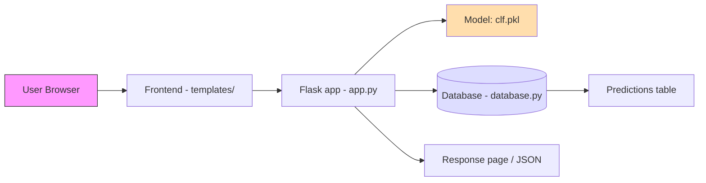
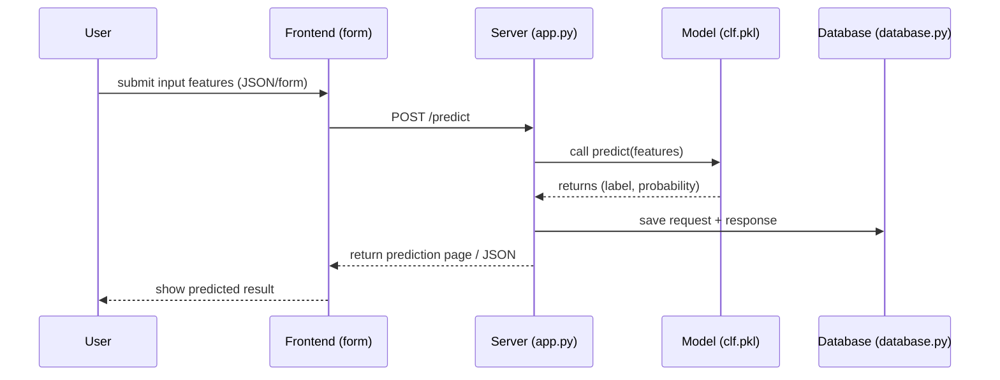
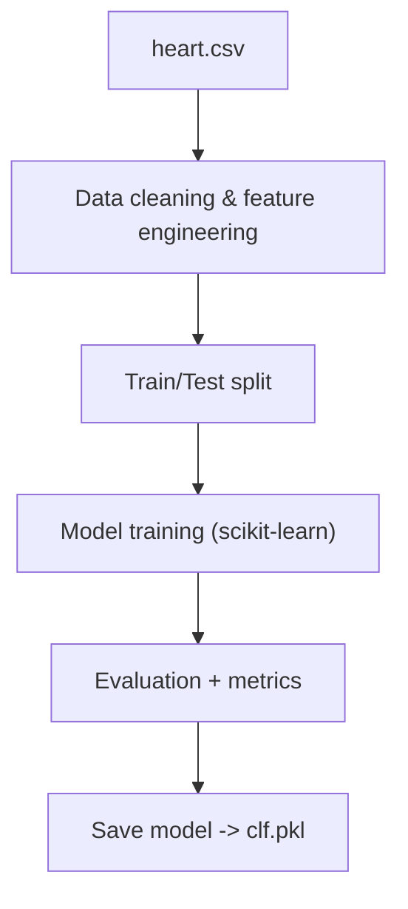
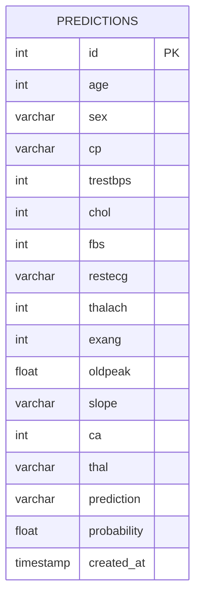

# Heart Disease Predictor

**Repository:** https://github.com/Kaustubh01/Heart-Disease-Predictor

---

## 🚀 Project summary

A small ML-powered web app that predicts the likelihood of heart disease from patient features. The project contains:

- A Jupyter notebook with EDA & model training (`hear_disease_predictor.ipynb`).
- A trained model file (`clf.pkl`) saved for inference.
- A Flask web service in `app.py` that serves the model and HTML pages (templates under `templates/` and static assets under `static/`).
- `database.py` to store request/prediction logs (DB schema example provided below).
- Dataset used for development: `heart.csv`.
- `requirements.txt` listing Python dependencies.

---

## 📂 Repository structure (example)

```
/
├─ .idea/
├─ datasets/
├─ models/
├─ static/
├─ templates/
├─ app.py
├─ database.py
├─ clf.pkl
├─ hear_disease_predictor.ipynb
├─ heart.csv
└─ requirements.txt
```

Adjust the list above if your repo structure differs.

---

## ⚙️ How it works — high-level architecture

1. **Data & Training**
   - EDA and preprocessing in `hear_disease_predictor.ipynb`.
   - Model trained (e.g., scikit-learn) and saved as `clf.pkl`.

2. **Web app / API**
   - `app.py` loads `clf.pkl` on startup and exposes endpoints for prediction and UI pages.
   - Front-end templates collect patient features and POST them to a predict route; server returns the prediction.

3. **Database / Logging**
   - `database.py` contains DB setup and functions to persist input features and prediction results for auditing and analytics.

4. **Deployment**
   - App can be deployed to Heroku / Render / Vercel / any container host using Docker + Gunicorn. The hosted URL above should point to your deployment.

---

## 📈 Architecture & Data-flow diagrams

> The following diagrams use Mermaid syntax and can be pasted into Markdown viewers that support Mermaid (GitHub renders Mermaid in some places, or use third-party previewers).

### System architecture (Mermaid flowchart)



### Data flow for prediction (Mermaid sequence)



### Model training pipeline (Mermaid)



---

## 🗄️ Example DB schema (dbdiagram / SQL)

If you want to create an ERD or import to dbdiagram.io, use this dbdiagram snippet (simple `predictions` table):

```dbml
Table predictions {
  id int [pk, increment]
  age int
  sex varchar
  cp varchar        // chest pain type
  trestbps int
  chol int
  fbs int
  restecg varchar
  thalach int
  exang int
  oldpeak float
  slope varchar
  ca int
  thal varchar
  prediction varchar
  probability float
  created_at timestamp [default: `CURRENT_TIMESTAMP`]
}
```

**Mermaid ERD**



---

## 🛠️ Local setup & run

### Prerequisites

- Python 3.8+
- pip
- (optional) virtualenv

### Install

```bash
git clone https://github.com/Kaustubh01/Heart-Disease-Predictor.git
cd Heart-Disease-Predictor
python -m venv venv
# mac / linux
source venv/bin/activate
# windows (powershell)
venv\Scripts\Activate.ps1
pip install -r requirements.txt
```

> If `requirements.txt` is missing or incomplete, typical dependencies include:
```
Flask
pandas
numpy
scikit-learn
joblib
gunicorn
```

### Run the app

```bash
# If app.py contains `if __name__ == '__main__': app.run(...)`
python app.py

# Or use Flask CLI if configured
export FLASK_APP=app.py
flask run
```

Open `http://127.0.0.1:5000/` in your browser (or the port shown).

---

## 🔁 Example `curl` request (generic)

> Update the URL and JSON keys to match your `app.py` routes and expected features.

```bash
curl -X POST "http://localhost:5000/predict" \
  -H "Content-Type: application/json" \
  -d '{
    "age": 63,
    "sex": 1,
    "cp": 3,
    "trestbps": 145,
    "chol": 233,
    "fbs": 1,
    "restecg": 0,
    "thalach": 150,
    "exang": 0,
    "oldpeak": 2.3,
    "slope": 0,
    "ca": 0,
    "thal": 1
  }'
```

---

## 🐳 Docker & Deployment

### Dockerfile (example)

```dockerfile
FROM python:3.10-slim
WORKDIR /app
COPY . /app
RUN pip install --upgrade pip
RUN pip install -r requirements.txt
EXPOSE 5000
CMD ["gunicorn", "--bind", "0.0.0.0:5000", "app:app"]
```

### Procfile (Heroku)

```
web: gunicorn app:app
```

---

## ✅ Tests & validations (suggested)

- Add a small unit test to verify the model loads and predicts on a sample row.
- Add server-side validation for incoming JSON/form fields.
- Add CI to run linting and tests.

---


